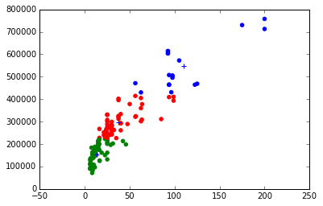
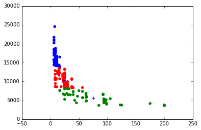
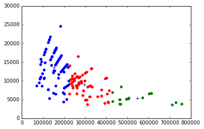
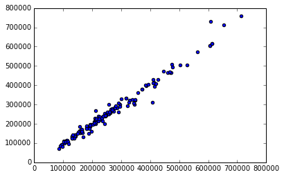

## Homework - Due July 25th 2016

* For the following, continue to use the github repository you made for your project
* You don't have to use the same data that you used from the previous homework assignment if you have decided to change what your project is about.

### Identify some attributes where you would expect clustering to be successful.

- Robot Strength and Supplier Cost 
- Cost Per Strength and robot strength 
- Cost Per Strength and Supplier Cost

### Try two or more different clustering algorithms, and experiment with different numbers of clusters.
- k-means 
- denisty scan 

### If the clustering works well, try to give descriptive names for the different clusters you have found. If the clustering isn't successful, try to hypothesise why your data is some homogenous (and try clustering on different attributes).

K-Means Clustering works well. 

Kmeans cluster graphs are below: 

* Clusters of Supplier Cost based on robot strength

The silhouette score is 0.581. 

* Clusters of Robot Strength based on cost per strength

The silhouette score is 0.5675

* Clusters of Supplier Cost based on Cost Per Strength 

The silhouette score is 0.5776

Dbscan cluster couldn't be performed as the dbscan code couldn't produce clusters. The input and output are as below:

dbscan = sklearn.cluster.DBSCAN(eps=0.3, min_samples=3)
dbscan_cs= dbscan.fit(target_info)
dbscan_cs.labels_ 
Output: 

array([-1, -1, -1, -1, -1, -1, -1, -1, -1, -1, -1, -1, -1, -1, -1, -1, -1,
       -1, -1, -1, -1, -1, -1, -1, -1, -1, -1, -1, -1, -1, -1, -1, -1, -1,
       -1, -1, -1, -1, -1, -1, -1, -1, -1, -1, -1, -1, -1, -1, -1, -1, -1,
       -1, -1, -1, -1, -1, -1, -1, -1, -1, -1, -1, -1, -1, -1, -1, -1, -1,
       -1, -1, -1, -1, -1, -1, -1, -1, -1, -1, -1, -1, -1, -1, -1, -1, -1,
       -1, -1, -1, -1, -1, -1, -1, -1, -1, -1, -1, -1, -1, -1, -1, -1, -1,
       -1, -1, -1, -1, -1, -1, -1, -1, -1, -1, -1, -1, -1, -1, -1, -1, -1,
       -1, -1, -1, -1, -1, -1, -1, -1, -1, -1, -1, -1, -1, -1, -1, -1, -1,
       -1, -1, -1, -1, -1, -1, -1, -1, -1, -1, -1, -1, -1, -1, -1, -1, -1,
       -1], dtype=int64)

### Try building decision trees on your data. If you think simplicity would be good, try to make it as simple as possible. If you think accuracy is more important, use ensembling or any other techniques that you have learned.

* Bagging Regressor with scatter plot as below:
 

* Random Forest Tree with scatter plot as below:

### Modify one of the models you have created so that you can evaluate its bias-variance trade-off. 

The selected model is Lasso model with Robot Strength data as X and Supplier Cost as y. A train_test_split with test size of 0.3 was performed. The model provided the following statistical values: 
* explained_variance_score = 0.846
* mean_absolute_error = 39552
* median_absolute_error = 32887
* Coefficient of determination = 0.840

#### K-Fold Cross Valuation 

10 folds of cross validation were applied with the following mean values: 
* r2 = -1.025
* mean_abolute_error = 54163
* median_abolute_error = 49002

#### GridSearch 

GridSearch with 6 folds and paramatters of 'fit_intercept', 'normalize', 'copy_X and 'alpha' was applied. The resulted GridSearch best scores are as below: 

* r2= 0.79
* mean_abolute_error = 44794
* median_abolute_error = 37281
